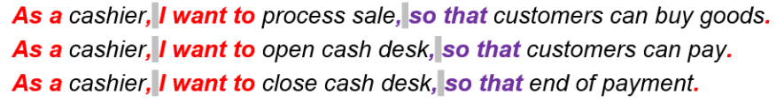
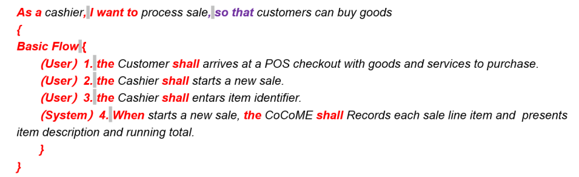
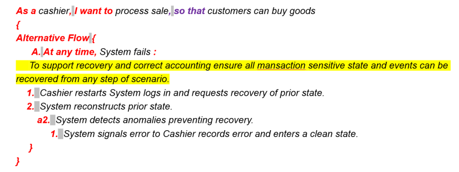

# 主要结构：

## 用例描述（用户故事形式）：

### 用户故事
   用户故事更容易理解，用户故事基本不包含专业术语，若组织成故事，那么会增强人们对故事的记忆。其结构较为简单方便更改，在客户，开发人员及用户之间谈论需求时，短时间的及时反馈能促进相互学习与理解。
   
   一个完整的用户故事包含三个要素：
   角色（who）：谁要使用这个
   活动（what）：要完成什么活动
   价值（value）：为什么要这么做，这么做能带来什么价值

   该部分采用基础用户故事形式，作为一个<用户角色>, 我想要<完成活动>, 以便于<实现价值>。案例中红色字段为必填项，紫色字段为选填项，注意：案例中灰色空格不可被忽略。
   
   

## 用例内部表述（EARS形式）案例：

   该部分采用基础EARS形式，本部分整体为选填项，当需要对用例进行内部描述时进行填写，其中NUM.后面的需要表述当前需求是用户需求还是系统需求（User/System），另外案例中红色字段为必填项，紫色字段为选填项，注意：案例中灰色空格不可被忽略。
   
   

## 补充信息案例：

   该部分采用基本的自然语言描述形式，对需求的细节进行补充，另外案例中红色字段为必填项，黄色背景为选填部分，对细节进行补充，注意：案例中灰色空格不可被忽略（由于技术原因该部分大括号内部的空格为两个）。

  
