# Conversion result

## ATM

### Use Case Diagram

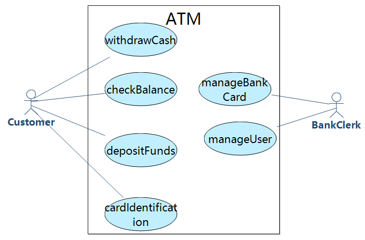

### Systematic Sequential Diagram

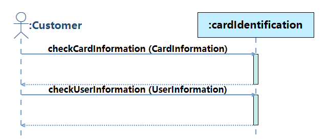

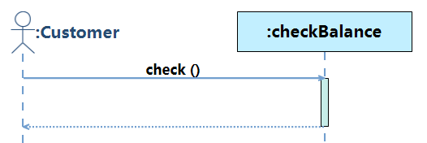

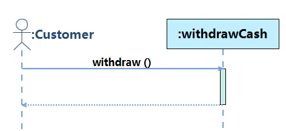

### Concept Class Diagram

## COCOME

### Use Case Diagram

### Systematic Sequential Diagram

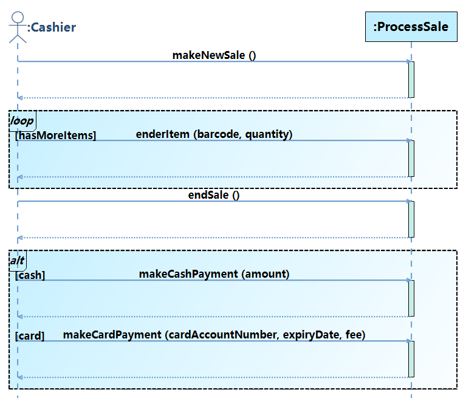

### Concept Class Diagram

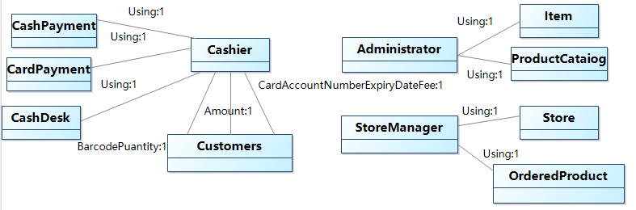

## LibraryMS

### Use Case Diagram

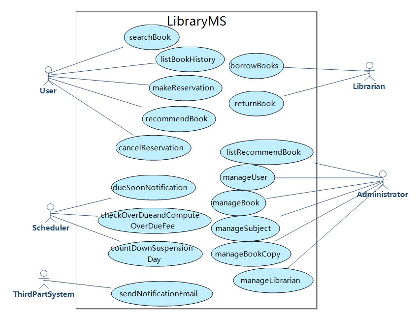

### Systematic Sequential Diagram

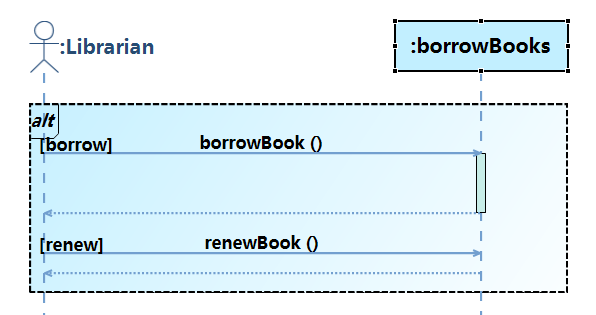

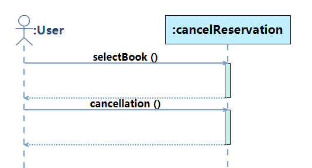

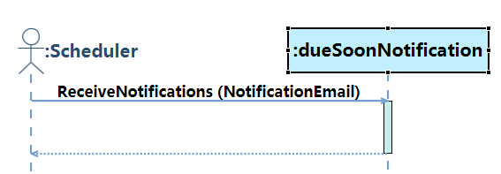

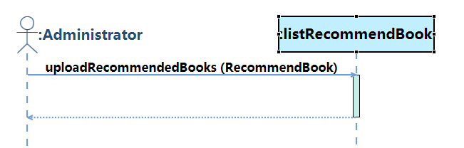

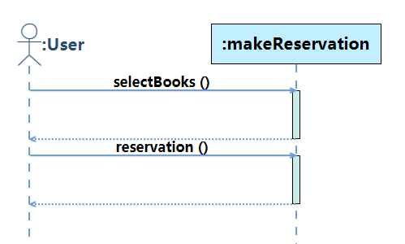

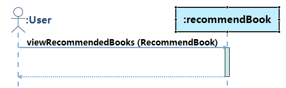

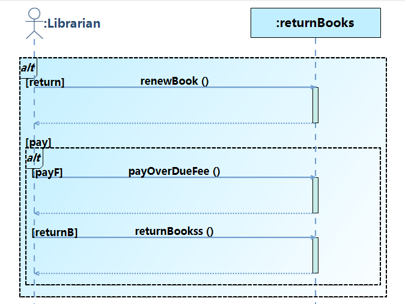

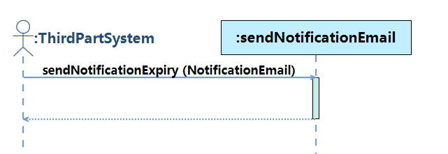

### Concept Class Diagram

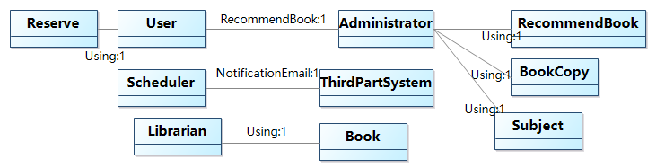

## LoanPS
### Use Case Diagram

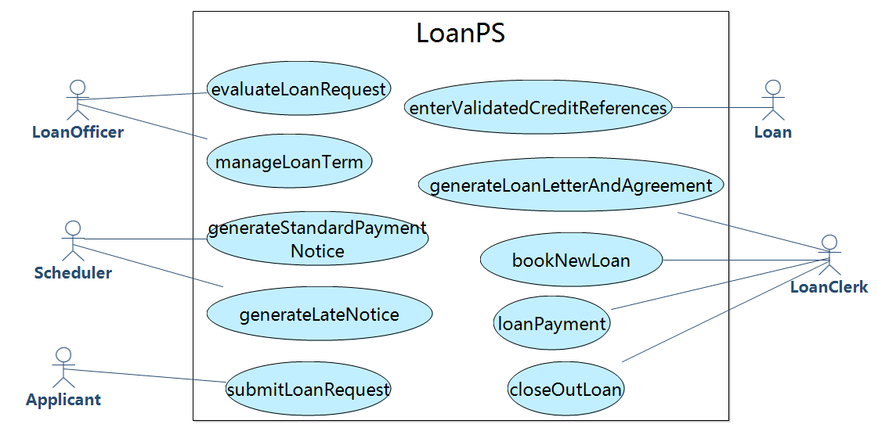

### Systematic Sequential Diagram

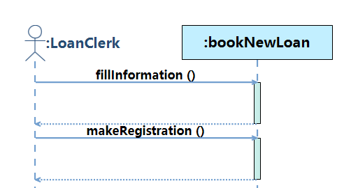

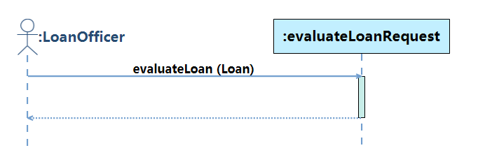

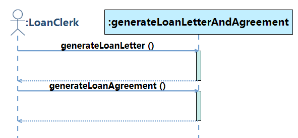

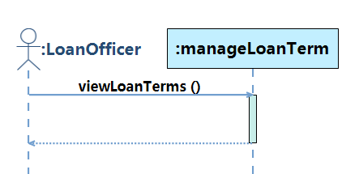

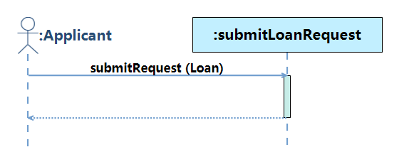

### Concept Class Diagram

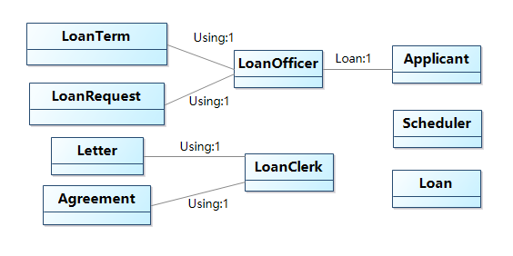

## ScholarUC

### Use Case Diagram

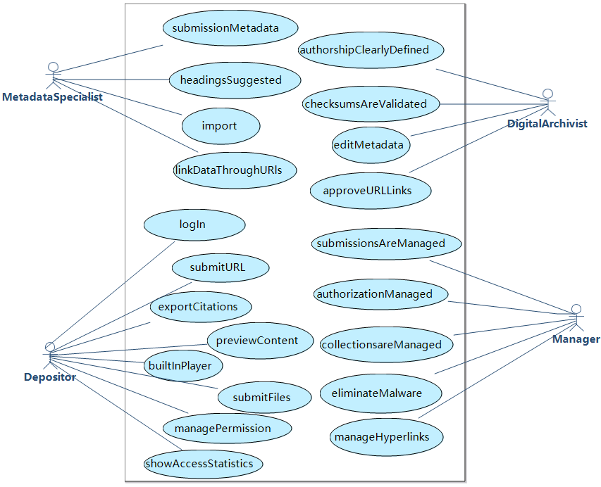

### Systematic Sequential Diagram

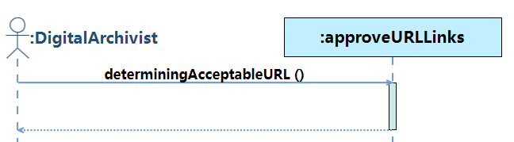

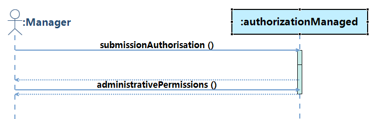

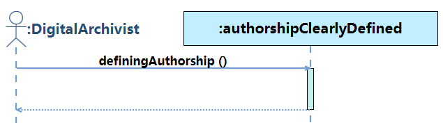

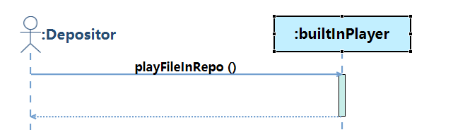

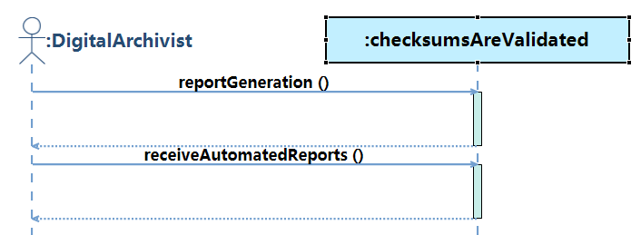

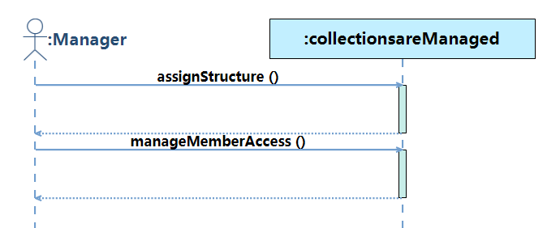

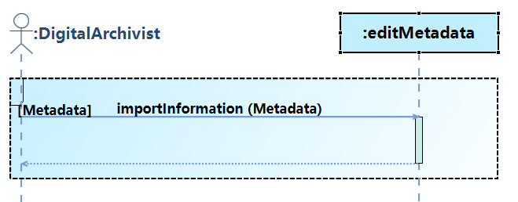

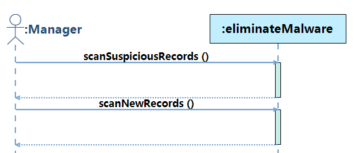

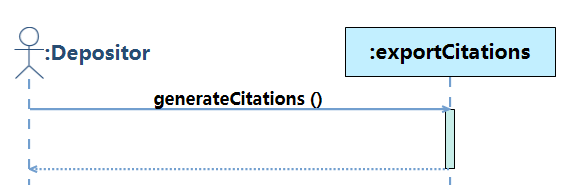

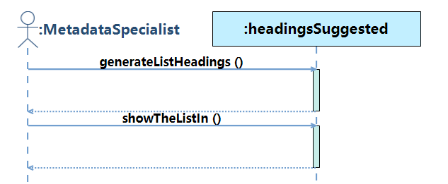

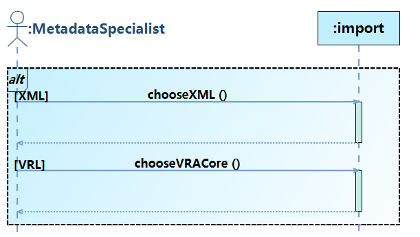

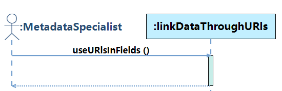

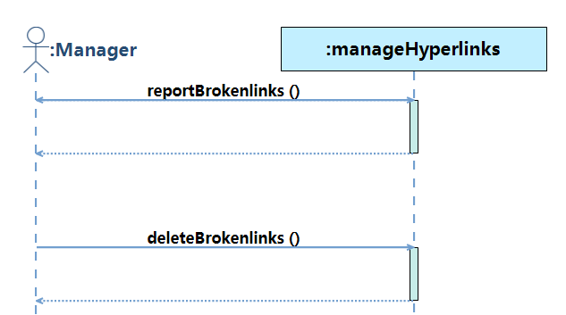

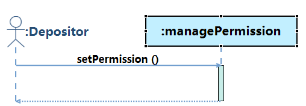

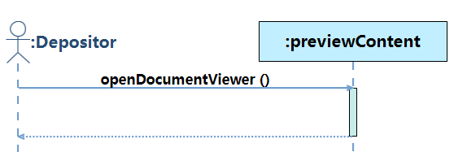

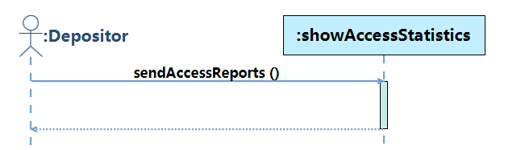

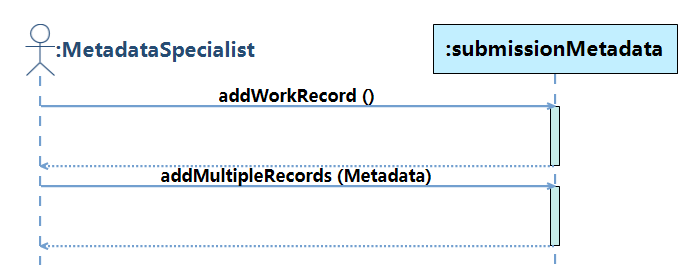

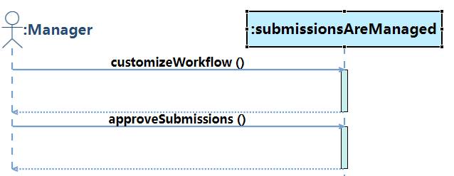

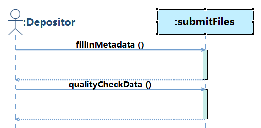

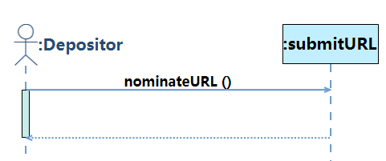

### Concept Class Diagram

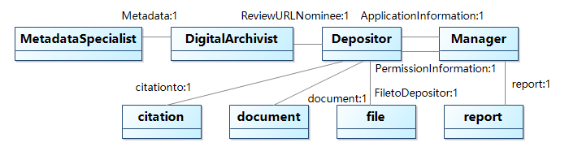
