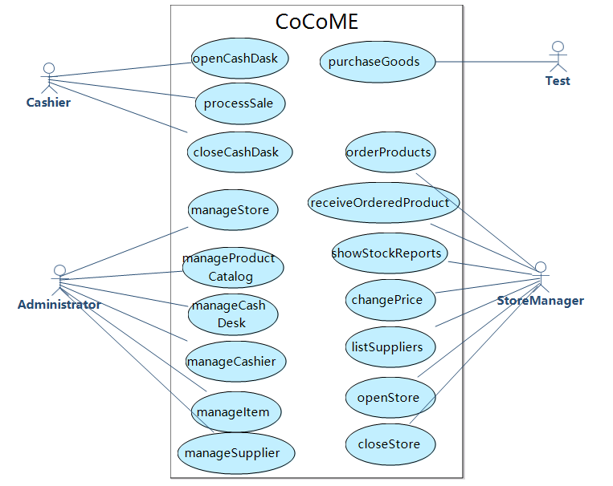

# Conversion result

## ATM

### Use Case Diagram

### Systematic Sequential Diagram

### Concept Class Diagram

## COCOME

### Use Case Diagram

### Systematic Sequential Diagram

### Concept Class Diagram

## LibraryMS

### Use Case Diagram

### Systematic Sequential Diagram

### Concept Class Diagram

## LoanPS
### Use Case Diagram

### Systematic Sequential Diagram

### Concept Class Diagram

## ScholarUC

### Use Case Diagram

### Systematic Sequential Diagram

### Concept Class Diagram

