# Extension of iStar Model

In the above introduction we can find that the IStar model does not describe all requirements, because the IStar model wants to express the user's requirements and does not take into account the way the system operates, but if you want to implement the conversion from the iStar model to UML, you need the relevant information inside the system, and how to implement this part of the information in the most effective way will be the supplement of this paper The most effective way to implement this additional information will be a major challenge in this paper.

In the iStar model, the main missing information is divided into three areas. Firstly, the concept of order is missing in the IStar model. Secondly, the tasks in the iStar model lack information such as loops and selections. Thirdly, the concept of entities is missing from the IStar model. After discussion we will use two approaches to add to the above information. For the concepts of sequence, loops and selection, this will be achieved by extending the IStar metamodel and creating the appropriate modelling tools to be added by the modellers. The addition of entity information to the IStar metamodel is more costly and will be done by an algorithm that automatically identifies some of the entity information to generate a concept class diagram, which will then be added to the generated UML model by modellers.

## Complement Sequence

First, we need to solve the problem that the iStar model lacks the sequence property. We will add a Boolean type attribute isPrior to the Task element in the iStar model metamodel, and introduce a reference (previousTask) to point to itself. If isPrior is true, it means that the current Task is not the first element, if false, then the current Task is the first element and the sequence should start from here. previousTask is used to point to the next Task of the current Task, if previousTask does not point to the next Task that means that the sequence ends.

## Complement Interaction Information

Then it is necessary to solve other problems in converting Task to Interaction, which has two forms of CombinedFragment,  Loop and Alt (selection). Whether it is an Alt can be determined by whether the relationship with the other elements is OrRefinement. However, whether it is a loop iStar cannot be indicated. To deal with this problem, we add two properties of Boolean type isCombinedFragment and isLoop in Task, which is used to determine whether there is a CombinedFragment element and whether it is a Loop element respectively. If the isCombinedFragment of the Task is false, the Task will have no CombinedFragment attribute in the Interaction after the conversion, and if it is true, we will continue to judge whether isLoop is true, and if it is true the Task will have the Loop property, and if it is false, we will end the judgment.

Since there is no Operator element in the iStar model in CombinedFragment, we add a Constraint element to the Metamodel for conversion to an Operator element.

## Complement Entity

As there is no explicit Entity related information in the iStar model, we refine this part by the modeler's judgement. Firstly, we have added the Boolean type attribute isEntity to the Role element, which allows the modeler to determine by their own judgement whether the current Role element can be an Entity or not. Secondly, we have also added the isEntity Boolean attribute to the Resource element, so that the modeller can determine whether the current Resource element is an Entity or an Attribute, and we have added two links to the Resource element itself. The association link is used to express the association relationship between an entity and an entity, and the attribute link is used to express the subordination relationship between two Resource (equivalent to an Entity and equivalent to an Attribute).

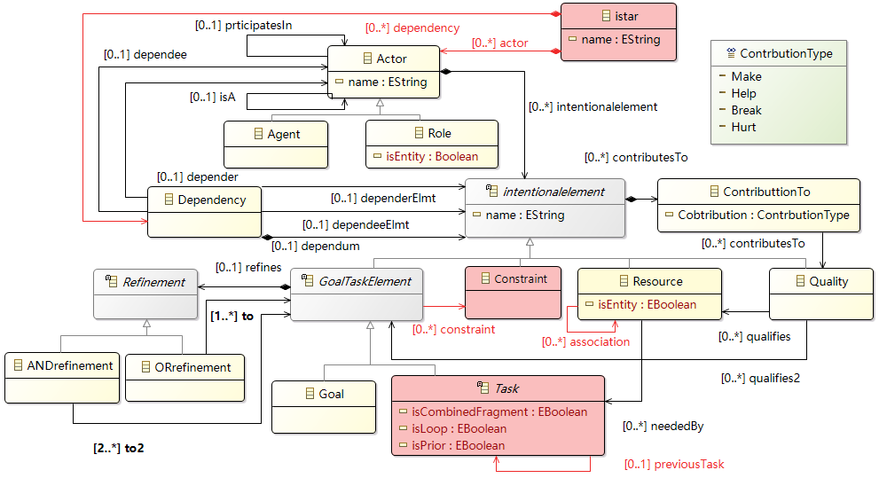

# iStar2UML: Transformation from iStar to UML models
This section describes how to convert the iStar model into a UML model based on the Metamodel introduced in the previous section. First introduce the conversion rules. We  have pictures to illustrate the elements of iStar on the left and the conversion results of UML on the right, and use dashed lines with arrows to indicate the conversion direction and different colored lines to indicate the conversion rules for different elements in the same picture, then the conversion algorithm is introduced.

## Use case diagram conversion rules
In UML, an Actor is an external entity that interacts with the system. It can be a user,  external system that can interact with the system, or a basic device. In the Goal model, Actors are divided into two categories,Role and Agent. Agent is a specific instance, such as a person, organization, or department. It is not suitable to convert Agent to Actor in UML because Agent is more specific and has more limitations. Role  is an abstract description of a certain group of people, such as students. It is closer to the meaning of Actor in UML, so it can be converted directly.

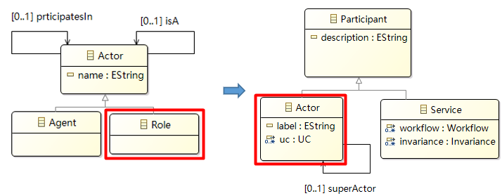

The UseCase describes the function of the system as a series of events and provides valuable observations for the operator. In Goal model, a Goal is a state that the Actor wants to achieve, and there is a clear completion standard. They all describe behavior or state from the perspective of Actor so they can be transformed. However, not all goals can be converted to UseCase, only goals at the root can be converted. At present, we do not consider the situation when Goal is connected to another Goal through Refinement. This problem will be improved in the follow-up work.

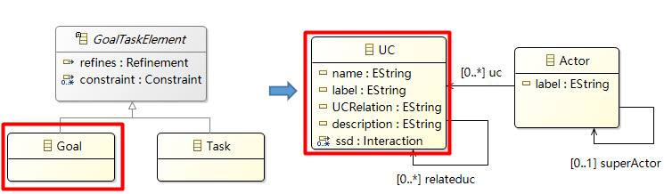

## Interaction part of the conversion
A Task in the Goal model represents an action that the actor wants to perform, usually to achieve a Goal. So it is possible to convert a Task that completes the same Goal into a System sequence diagram.This interaction part of UML consists of the following elements, Message, Execution, CombinedFragment and AbstractEnd. So we can convert a Task element to an entire interaction elements, but if this Task is joined to another Intentional elements with OrRefinement connection, then no relevant conversion will be performed on it.

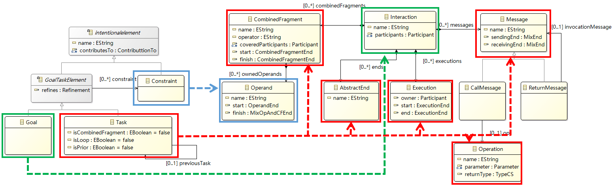

The Task with the related Resource is corresponding to the following elements in UML:
Operation and Parameter. Task is transformed into Operation, however, if the Task is connected by multiple other Intentional Elements with OrRefinement, it will not be transformed. transforming Parameter in Goal model into Operation in UML. transforming Resource in Goal model into Parameter in UML.

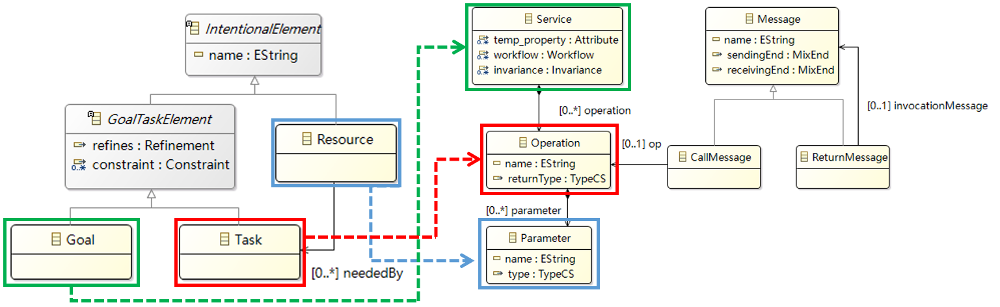

## Concept class diagram section
Since the Goal model Metamodel in this part is made according to the Entity part of the UML Metamodel, only the corresponding elements need to be converted during the conversion. Since only Entity is added to the Goal model Metamodel for now, only this part will be converted, and the rest of the missing parts will be added to the converted UML model.
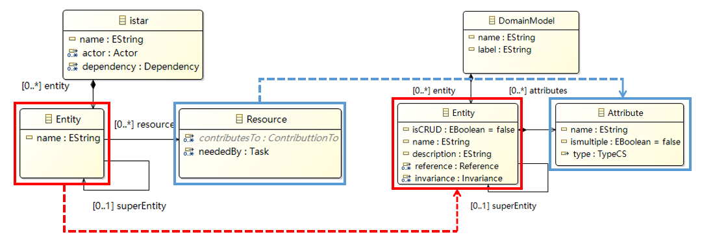

# Evaluation

In this section, we will evaluate the proposed approach by answering three research questions.

## RQ1: What is the return on investment (ROI) for the iStar expansion method of the iStar2UML method?
### Evaluation Metrics
Return On Investment (ROI) : In order to demonstrate that the benefits obtained from reconverting iStar after it has been extended by the iStar2UML method are greater than those obtained from direct conversion, we will test the iStar2UML method by means of a return on investment (ROI) formula. 

$$ROI=(CVI-CI)/CI=(EGAE-EGBE)/NES$$

Where CVI represents the current value of the investment, CI is Cost of Investent, EGAE is Elements Generated After Extension, EGBE is Elements Generated Before Expansion, NES is Number of Elements Supplemented.

### valuation Resul

In order to demonstrate that the benefits obtained by reconverting iStar after extension by the iStar2UML method are greater than those obtained by direct conversion, we will test the iStar2UML method by means of the return on investment (ROI) formula.
The ROI is obtained by converting the standard and extended iStar models by taking the ratio of the number of elements produced after the extension minus the number of elements produced before the extension (recovery value), to the number of elements produced after the extension (cost input). When the ROI is greater than 1, it shows that our method is worthwhile, and we will also demonstrate this at a theoretical dimension and at a case dimension.

$Theoretical Dimension :$ We collected the number of expanded elements in Sequenc information and Entity information for the iStar models from the iStar2UML method at the conversion formula level, and also counted the newly generated elements for the generated UML models. The ROI formula resulted in an ROI of 250% for System Sequence Diagrams and 225% for Concept Class Diagrams, for an overall ROI of 237.5%, as shown in Table 1, but these are theoretical values and need to be verified in specific cases.

#### Table 1 Theoretical dimensional ROI for the iStar2UML method

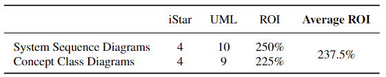

$Case Dimension :$ We will convert the standard iStar model in two ways (Conversion option 1: Execute the iStar2UML method to convert the standard iStar model. Conversion scenario 2: Execute the iStar2UML method to convert the extended IStar model.) The conversion of the cases is achieved by means of the conversion rules we have developed, and in the process we record the number of elements expanded, the elements generated and other data. The information on the number of elements to be expanded in each of the five cases is shown in Table 2.

#### Table 2 Number of elements to add to the case

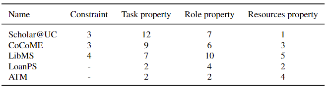

 Based on these two options and the two parts of the expansion, we derived the ratio of expanded to unexpanded elements for the system sequence diagram and the ratio of expanded to unexpanded elements for the concept class diagram, respectively, as shown in Tables 3.
 
 #### Table 3 Comparison of generating System Sequence Diagrams and Concept Class Diagrams with and without the extension method
 
 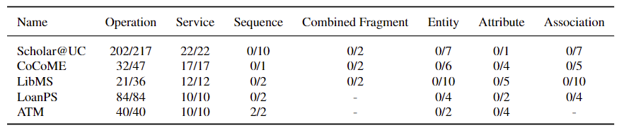
 
  Finally the above data was calculated based on the return on investment (ROI) and the final results are shown in Table 4. from the table we can see that all the results are greater than or equal to 100% and the overall average is also at 152.4%, which can effectively prove that our conversion method can achieve more demand with a small number of additions.
  
 #### Table 4 Case Dimension ROI for Systematic Sequential and Conceptual Class Diagrams

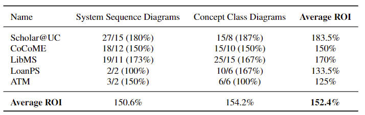

## RQ2: Is the result of the iStar2UML method conversion correct and what is the success rate?

### Evaluation Metrics
Relative Success : Success here refers to the correctness of the conversion results, which will be compared with the results of the manual conversion.

$$Relative Success Rate=(NCRE/NSE)/N$$

$$Overall Success Rate=(ADSRC)/N$$

 Where NCRE represents Number of Conversion Result Elements, NSE is Number of Standard Elements, ADSRC is All Diagram Success Rates Cumulative of UML.

### valuation Resul
With the help of domain experts, the experiments will be carried out with the correct answers and we will compare the number of standard answer elements with the number of conversion result elements, obtain the conversion success rate for each UML diagram and calculate the evaluation value to the final success rate.

 #### Table 5 Transformation result from iStar model to Use Case Diagram

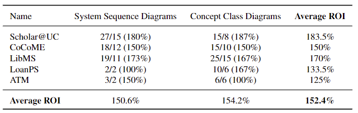

To determine the success rate of the transformation results, we first determine elements of the expected result of the transformation case and compare it with the elements of the actual transformation results to obtain the final success rate.

**Use Case Diagram:**
As shown in Table 5, we can completely convert actor, UC and association in use case diagram. The success rate of conversion can reach 100%.

#### Table 6 Conversion results from iStar model to System Sequence Diagram

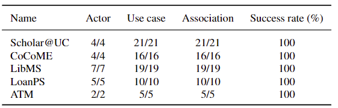

**System Sequence Diagram:**
After we extend the iStar metamodel and the filling in of sequence information by the modelers. As shown in Table 6, we can completely convert the system operation, system service, system sequence, and combined fragment (alt, loop) in the system sequence diagram. The success rate of conversion can also reach 100%.

#### Table 7 Conversion results from iStar model to Conceptual Class Diagram

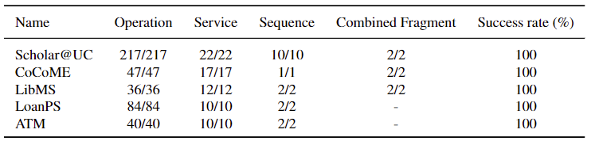

**Conceptual Class Diagram:**
 Our extended iStar metamodel can provide the modeler with possible entity information with a success rate of (63.3%, 28.7%, 50%, 59.6%, 43.3%). This is because even if we transform all the elements that already exist in the iStar model, there is still some information from the concept class diagram that does not exist in the iStar model. The remaining missing information can be manually added to the information about the results of the transformation.
 
 #### Table 8 Transformation results from iSatr model to UML model
 
 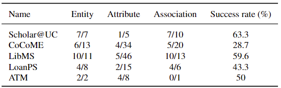
 
 As shown in Table 8, the extension of the iStar model, and the assistance of the modelers, resulted in conversion rates of (87.7%, 76.3%, 83.3%, 86.5%, 81.1%), which is sufficient to demonstrate the completeness of our conversion results.
 
 ## RQ3: Which method is more efficient, the iStar2UML method or the manual conversion method, given the same inputs?
 
### Evaluation Metrics
Time/Error Reduction : We recruited six experimenters for the model conversion experiment, divided them into two groups and converted five cases using the manual conversion method and the iStar2UML method respectively, and recorded the time and number of errors in the conversion process, and derive Time Reduction and Error Reduction for the iStar2UML method.

$$Time Reduction= Manual_{Time}-iStar2UM_{Time}/Manual_{Time}$$

$$Error Reduction= Manual_{SR}-iStar2UML_{SR}$$

Where $Manual_{Time}$ represents Number of Manual Method Time, $iStar2UML_{Time}$ is Manual Method Time, $iStar2UML_{Time}$ is iStar2UML Method Time, $Manual_{SR}$ Manual Success Rate, $iStar2UML_{SR})$ is iStar2UML Success Rate.

### valuation Resul

We recruited six experimenters for the model conversion experiment, divided them into two groups and converted five cases using the manual conversion method and the iStar2UML method respectively, and recorded the time and number of errors in the conversion process.
We will compare these data to prove that our method is better. Time Reduction and Error Reduction, i.e. the ratio of the experimental data of the manual conversion method to the experimental data of the iStar2UML method (containing the operation time, number of errors).
We recruited six experimenters to perform model conversion experiments, three by the iStar2UML method for five cases (iStar2UML: 1. Experimenters understand the iStar model. 2. Add expansion information to the iStar model. 3. Execute the iStar2UML tool. 4. Experimenters add UML diagrams.) The other 3 by manual methods (Manual methods: 1. Experimenter understands the iStar model. 2. Experimenter draws UML diagrams.) Converting 5 cases, recording the time and number of errors in the process and calculating the average value, which can be obtained by using the formula. The time taken to convert was reduced by an average of 21.4% and the correct rate increased by 11.6%.

 #### Table 9 Cost indicators for system sequence diagrams and concept class diagrams

 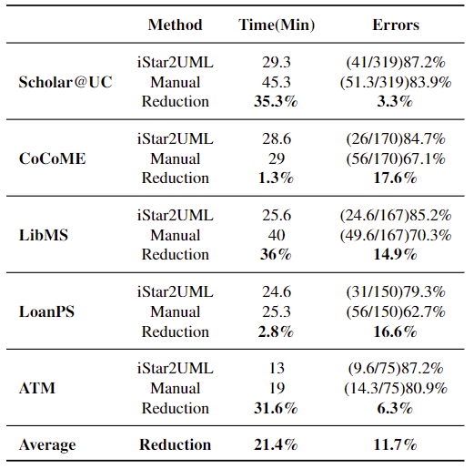
 
Analysing the data we can also see that in cases where the time taken by the two methods is relatively similar (e.g. COCOME, LoanPS), the iStar2UML method has a much higher correct rate than the manual method. This can indicate that the iStar2UML method achieves a higher correct rate than the manual method in the case of less time spent, and is better than the manual method in the same situation.
