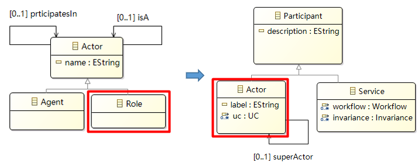
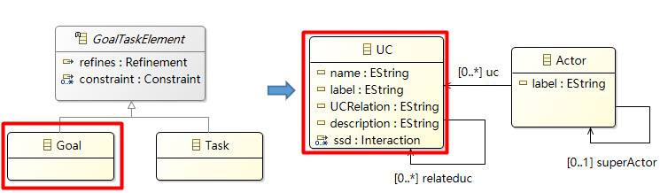
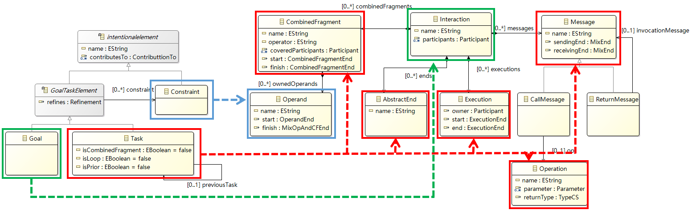
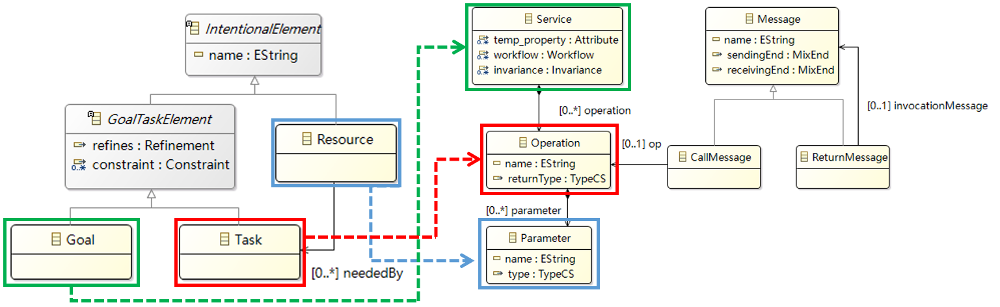
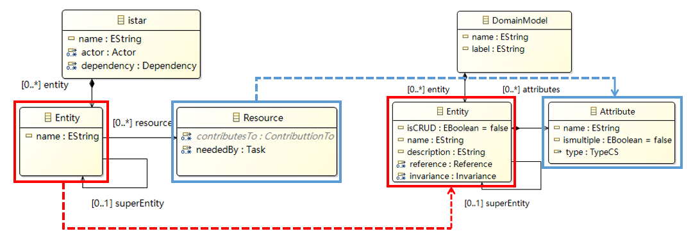
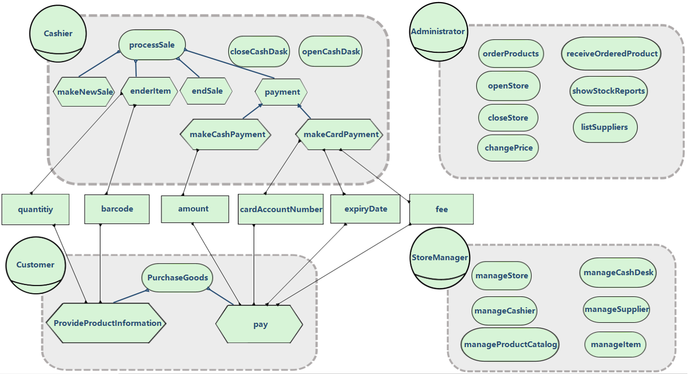
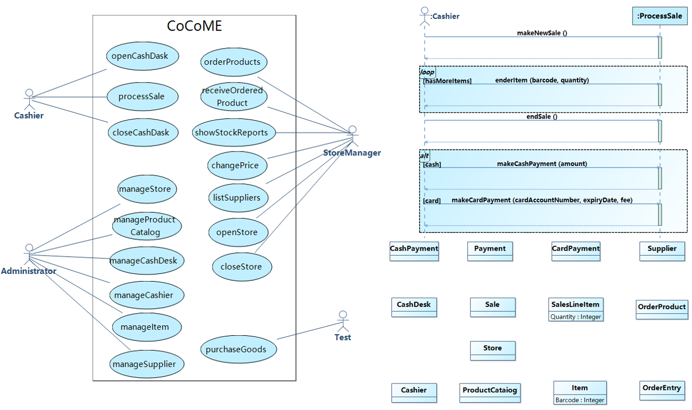

# Goal2UML: Transformation from iStar to UML models
This section describes how to convert the iStar model into a UML model based on the Metamodel introduced in the previous section. First introduce the conversion rules. We  have pictures to illustrate the elements of iStar on the left and the conversion results of UML on the right, and use dashed lines with arrows to indicate the conversion direction and different colored lines to indicate the conversion rules for different elements in the same picture, then the conversion algorithm is introduced.

## Use case diagram conversion rules
In UML, an Actor is an external entity that interacts with the system. It can be a user,  external system that can interact with the system, or a basic device. In the Goal model, Actors are divided into two categories,Role and Agent. Agent is a specific instance, such as a person, organization, or department. It is not suitable to convert Agent to Actor in UML because Agent is more specific and has more limitations. Role  is an abstract description of a certain group of people, such as students. It is closer to the meaning of Actor in UML, so it can be converted directly.

The UseCase describes the function of the system as a series of events and provides valuable observations for the operator. In Goal model, a Goal is a state that the Actor wants to achieve, and there is a clear completion standard. They all describe behavior or state from the perspective of Actor so they can be transformed. However, not all goals can be converted to UseCase, only goals at the root can be converted. At present, we do not consider the situation when Goal is connected to another Goal through Refinement. This problem will be improved in the follow-up work.

## Interaction part of the conversion
A Task in the Goal model represents an action that the actor wants to perform, usually to achieve a Goal. So it is possible to convert a Task that completes the same Goal into a System sequence diagram.This interaction part of UML consists of the following elements, Message, Execution, CombinedFragment and AbstractEnd. So we can convert a Task element to an entire interaction elements, but if this Task is joined to another Intentional elements with OrRefinement connection, then no relevant conversion will be performed on it.

The Task with the related Resource is corresponding to the following elements in UML:
Operation and Parameter. Task is transformed into Operation, however, if the Task is connected by multiple other Intentional Elements with OrRefinement, it will not be transformed. transforming Parameter in Goal model into Operation in UML. transforming Resource in Goal model into Parameter in UML.

## Concept class diagram section
Since the Goal model Metamodel in this part is made according to the Entity part of the UML Metamodel, only the corresponding elements need to be converted during the conversion. Since only Entity is added to the Goal model Metamodel for now, only this part will be converted, and the rest of the missing parts will be added to the converted UML model.

## CoCoME Case study
We will use the RM2PT case of CoCoME (supermarket shopping system) as the caseof this experiment, and this process will be described below.Firstly, the Cashier can perform three actions,openCashDesk,closeCashDeskandprocessSale, and this part forms a simple use case diagram. When the actionpro-cessSaleis performed, it can be expanded to obtain the system sequence diagram.This part mainly reflects the interaction between Cashier and system, first tomak-eNewSale, then enter a loopenterItem, the customer will provide the cashier withinformation about the product barcode, quantity until the end of the cycle, and thenthe next actionendSale(end of sale). The last part is the domain model which mainlykeeps the entity data of the above process. The data stored areCashDesk,Cashier,Payment,CashPayment,CardPayment,Item,SalesLineItem.Based on the conditions provided above, we have created the corresponding Goalmodel.  First,  we  create  aCashierof  type  Role  with  three  goalsOpenCashDesk,CloseCashDeskandprocessSale. Next we need to add the following four tasks toprocessSale. The first task ismakeNewSaleand set it isPrior to ’false’ (to indicate thatthe current Task is the first element of the sequence) and connect it toprocessSaleviaAndRefinement. so that this task belongs toprocessSale. Then connect it to the nexttaskvia previousTask to get the order between tasks. The second task isenterItem(input item). In addition to doing the above, sinceenterItemis a special loop intask(customers may select multiple items), it is necessary to set its two propertiesisCom-binedFragmentandisLoopto true. The third task isendSale, which is a normal taskand only needs to be done like the first one. The last task isPayment, its previous-Task will not connect to otherTasks (used to indicate that the currentTask is the last element of the sequence), it is still a special task (selection) and We set itsisCom-binedFragmentproperty to ’true’.two new tasks need to be performed, the first oneisMakeCashPayment, which is connected to the task Payment withOrRefinement.The second one isMakeCardPayment, which is connected to the taskPaymentwithOrRefinement
Then create a Customer of type Role, which is used to simulate the customer’sactions. The customer’s goal isPurchaseGoods, which is set to the Intentional ele-ment.  And  in  order  to  accomplish  this  goal,  two  tasks  need  to  be  done.The  firstone,ProvideProductInformation, is connected to the Goal with anAndRefinementconnection, and the second one,Pay, is also connected to the Goal with anAndRefine-mentconnection.  Then  comes  the  part  that  completes  the  information  exchangebetween the cashier and the user, when the cashier implements theenterItemtask,the customer needs to implementProvideProductInformationto provide the cashierwith relevant product information. When the cashier goes to theenterItemtask, theuser’sProvideProductInformationtask needs to provide  the cashier with the rele-vant  product  information,  create  thebarcodeandquantitiyelements  to  be  passedusing Resource (which is of type Dependency), and connect the two tasks via depen-deeElmt/dependerElmt.  When  the  cashier  gets  to  themakeCashPaymenttask,  thecostumer’s ”paytask needs to provide the cashier with the relevant product infor-mation.  We  create  the  Resource  elementamountto  indicate  the  amount  of  thecommodities. Then the relevant tasks is connected via dependeeElmt/dependerElmtas the same way described above. When the cashier reaches themakeCardPaymenttask, the customer’spaytask needs to provide the cashier with the relevant prod-uct information.CardAccountNumber,expiryDate,fee, these Resources need to beconnected via dependeeElmt/dependerElmt to thepaytask. Next, create aStoreM-anagerof type Role, which is the goal fororderProducts,receiveOrderedProduct,showStockReports,changePrice,listSuppliers,openStore,closeStore. And it is goal to  create  the  Role typemanageStore,manageProductCatalog,manageCashDesk,manageCashier,manageItem,manageSupplier.Finally, there is the entity section where we can fill in the required entity infor-mation.CashDesk,Cashier,Payment,CashPayment,CardPayment,SwipePayment,Item,SalesLineItemand connectItemandSalesLineItemwith Resource’sbarcodeandquantitiyare connected.

## CoCoME Case conversion results
Next we give the results of the transformation, which will be divided into three parts, first is the use case diagram, which describes the relationship between actors and their use cases. Next is the system sequence diagram, which describes the use case processSale. Finally is the concept class diagram, which describes the entity information.

